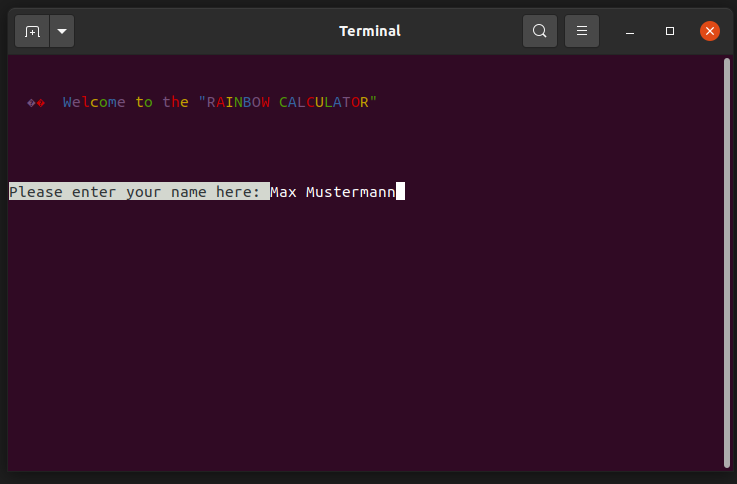
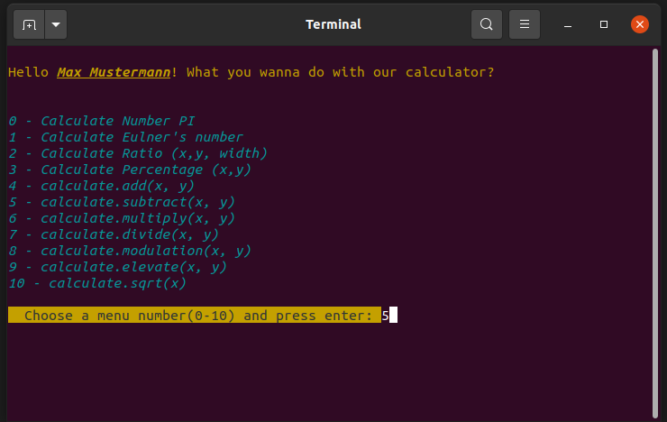
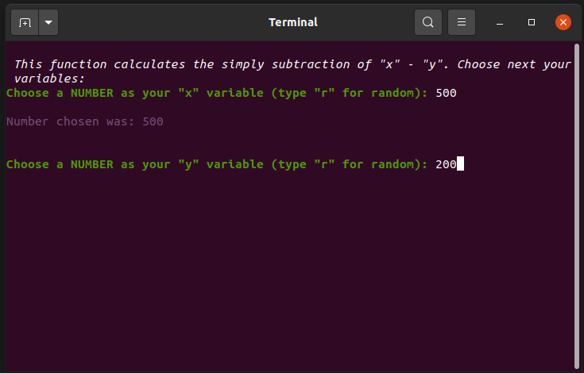
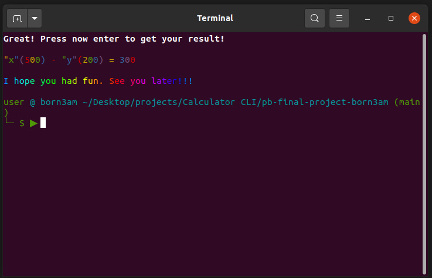

# Calculator on CLI (Command Line Interface). (15.09.2021)

Clone the repo and type at the terminal command line: node calculator

Choose a calculation option among these 11 options:

0 - Calculate Number PI
1 - Calculate Eulner's number
2 - Calculate Ratio (x,y, width)
3 - Calculate Percentage (x,y)
4 - calculate.add(x, y)
5 - calculate.subtract(x, y)
6 - calculate.multiply(x, y)
7 - calculate.divide(x, y)
8 - calculate.modulation(x, y)
9 - calculate.elevate(x, y)
10 - calculate.sqrt(x)

## Built with
- Javascript
- NPM package colors (https://www.npmjs.com/package/colors)
- NPM package chalk-animation (https://www.npmjs.com/package/chalk-animation)

